<!--
  LachlanCB · GitHub profile README
  Palette (LachlanCB brand): #0A0A0B black · #FFFFFF text · #9CA3AF muted · #C084FC purple
  Everything in assets/ is generated: edit scripts/build.mjs, then run `node scripts/build.mjs`.
  The snake lives on the `output` branch and is rebuilt by .github/workflows/profile.yml,
  along with the activity card and the ~/writing list.
-->


  

 

## `~/about`

I build the systems a business runs on. The automations, AI agents, dashboards and internal tools that sit behind the work.

I build with Claude Code. I write the spec, design the architecture, direct the build and check every result. The AI writes most of the code. I own whether it works in production.

Before the builds, I ran a $300–400k a year Amazon ads account. I still think in margins.



 

## `~/shipped`

Public repos. Click a card to open it.

<a href="https://github.com/LachyAI/time-guide"></a>
<a href="https://github.com/LachyAI/demo-site-generator"></a>

<a href="https://github.com/LachyAI/content-os"></a>
<a href="https://github.com/LachyAI/content-engine"></a>

 

## `~/in-production`

Most of what I build runs for clients or for me, so the code stays private. Here's what it does.



<a href="https://lachlancb.me"></a>

**Also shipped:** a competitor SEO audit app · a wireframe brief generator · a [bio storefront on Stripe](https://stan.lachlancb.me) · a [creator revenue calculator](https://creator-calc-opsscale.vercel.app) · an [Omi transcription webhook](https://github.com/LachyAI/omi-transcript-webhook). More at **[lachlancb.me/apps](https://lachlancb.me/apps)**.

 

## `~/stack`

Everything above runs on infrastructure I set up and run myself.


 

## `~/method`

Every build follows the same four steps, in this order. <a href="https://lachlancb.me/methodology/">Why the order matters →</a>

<a href="https://lachlancb.me/methodology/"></a>

 

## `~/writing`

Latest from [lachlancb.me](https://lachlancb.me). Refreshed automatically twice a day.

<!-- WRITING:START -->
- **[Your Skill Is Replaceable. Your Personal Brand Isn't.](https://lachlancb.me/personal-brand-between-you-and-ai/)** · 17 Aug 2026
- **[AI Content Isn't Dying. Average Content Is.](https://lachlancb.me/ai-content-dying-platforms-what-wins-now/)** · 17 Aug 2026
- **[Geographic Arbitrage Is the Best Raise You Never Got](https://lachlancb.me/geographic-arbitrage/)** · 8 Aug 2026
- **[The Chiang Mai Border Run: Why the Websites Are Wrong](https://lachlancb.me/chiang-mai-border-run/)** · 7 Aug 2026
- **[Where good information actually comes from](https://lachlancb.me/foundation-of-knowledge/)** · 24 Jul 2026
<!-- WRITING:END -->

 

## `~/toolbox`

**build**

**agents**

**data + infra**

 

## `~/activity`

  

<picture>
  <source media="(prefers-color-scheme: dark)" srcset="https://raw.githubusercontent.com/LachyAI/LachyAI/output/snake-dark.svg" />
  <source media="(prefers-color-scheme: light)" srcset="https://raw.githubusercontent.com/LachyAI/LachyAI/output/snake-light.svg" />
  
</picture>

 

## `~/next`

<a href="https://lachlancb.me/cv/"></a>

  

